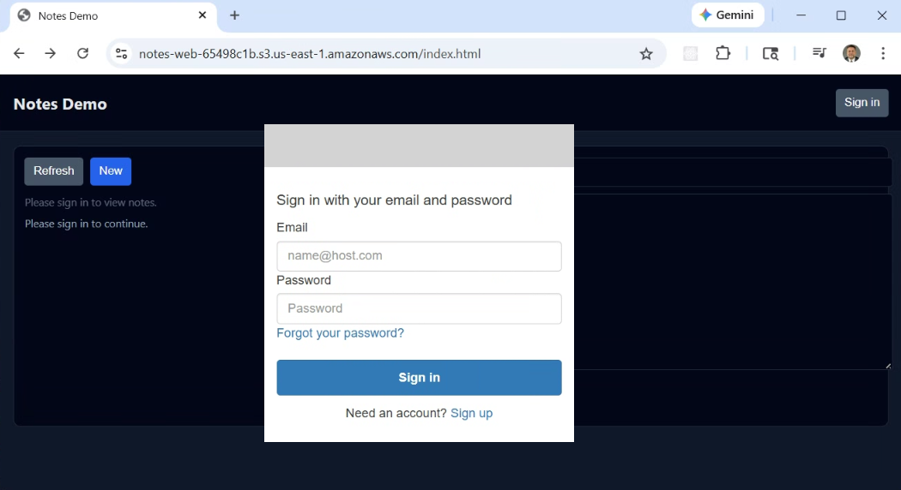

# AWS Serverless Authenticated CRUD API with Cognito, Lambda, DynamoDB, and API Gateway

This project delivers a fully automated **serverless, authenticated CRUD
(Create, Read, Update, Delete) API** on AWS, built using **Amazon API Gateway**,
**AWS Lambda**, **Amazon DynamoDB**, and **Amazon Cognito**.

It uses **Terraform** and **Python (boto3)** to provision and deploy a
**stateless, REST-style backend** secured with **JWT-based authentication**,
exposing HTTP endpoints for managing simple “notes” data — all without running
or managing any EC2 instances.

Authentication and authorization are handled natively by **Amazon Cognito**,
allowing users to sign in with email-based credentials and obtain JWT access
tokens that are validated directly by API Gateway before requests reach Lambda.

For testing and demonstration purposes, a lightweight **HTML web frontend**
integrates with Cognito’s Hosted UI and interacts directly with the secured API,
allowing authenticated users to create, view, update, and delete notes from a
browser.



This design follows a **serverless microservice architecture** where API Gateway
routes authenticated requests to dedicated Lambda functions, DynamoDB provides
fully managed persistence, and AWS handles scaling, availability, and fault
tolerance automatically.


## Key capabilities demonstrated

1. **Authenticated Serverless CRUD API** – REST-style endpoints protected by
   Cognito JWT authorizers, backed by Lambda functions for full CRUD operations.
2. **Stateless Compute Layer** – Independent, stateless Lambda functions enable
   horizontal scaling with zero idle cost.
3. **Managed NoSQL Storage** – DynamoDB with on-demand capacity provides
   low-latency, fully managed persistence.
4. **Native AWS Authentication** – Cognito User Pools issue and manage JWT
   tokens, eliminating the need for custom authentication logic in Lambda.
5. **Infrastructure as Code (IaC)** – Terraform provisions API Gateway routes,
   Cognito resources, Lambda functions, IAM roles, DynamoDB tables, and
   supporting infrastructure in a repeatable, auditable way.
6. **Browser-Based Test Client** – A simple static HTML frontend demonstrates
   secure, real-time interaction with the API using standard OAuth flows.

Together, these components form a **clean, minimal reference architecture** for
building **secure serverless APIs on AWS** — suitable for learning,
prototyping, or extending into more advanced event-driven and
identity-aware microservices.

## API Gateway Endpoints

The **Notes API** exposes REST-style CRUD endpoints through **Amazon API Gateway
(HTTP API)** and is secured using a **Cognito JWT authorizer**. All requests
must include a valid **Authorization: Bearer <JWT>** header issued by the
Cognito User Pool.

Each request is authenticated at the API Gateway layer before reaching Lambda.
The authenticated user identity is derived from the JWT and used to scope data
access in DynamoDB.

All endpoints return JSON and work with both CLI and browser-based clients.

> Note: In this demo, the note `owner` is derived from the authenticated
> Cognito user (JWT `sub` claim), not hardcoded.

---

### POST /notes

**Purpose:**  
Creates a new note owned by the authenticated user.

**Request Headers:**
Authorization: Bearer <JWT_ACCESS_TOKEN>
Content-Type: application/json

**Request Body (JSON):**
{
  "title": "Test Note 1",
  "note": "This is test note 1"
}

**Parameters:**

| Field | Type | Required | Description |
|------|------|----------|-------------|
| title | string | Yes | Note title |
| note | string | Yes | Note body/content |

**Example Request:**
curl -s -X POST https://<api-id>.execute-api.us-east-1.amazonaws.com/notes \
  -H "Authorization: Bearer <JWT_ACCESS_TOKEN>" \
  -H "Content-Type: application/json" \
  -d '{"title":"Test Note 1","note":"This is test note 1"}'

**Example Response (201):**
{
  "id": "2f2d0c5a-9f5f-4d7d-9e2c-1c8a5b8e3c21",
  "title": "Test Note 1",
  "note": "This is test note 1"
}

---

### GET /notes

**Purpose:**  
Lists all notes owned by the authenticated user.

**Example Request:**
curl -s https://<api-id>.execute-api.us-east-1.amazonaws.com/notes \
  -H "Authorization: Bearer <JWT_ACCESS_TOKEN>"

---

### GET /notes/{id}

**Purpose:**  
Retrieves a single note by ID for the authenticated user.

---

### PUT /notes/{id}

**Purpose:**  
Updates an existing note owned by the authenticated user.

---

### DELETE /notes/{id}

**Purpose:**  
Deletes a note by ID owned by the authenticated user.


## Prerequisites

* [An AWS Account](https://aws.amazon.com/console/)
* [Install AWS CLI](https://docs.aws.amazon.com/cli/latest/userguide/getting-started-install.html)
* [Install Terraform](https://developer.hashicorp.com/terraform/install)

If this is your first time following along, we recommend starting with this video:  
**[AWS + Terraform: Easy Setup](https://www.youtube.com/watch?v=9clW3VQLyxA)** – it walks through configuring your AWS credentials, Terraform backend, and CLI environment.

## Download this Repository

```bash
git clone https://github.com/mamonaco1973/aws-cognito-app.git
cd aws-cognito-app
```

## Build the Code

Run [check_env](check_env.sh) to validate your environment, then run [apply](apply.sh) to provision the infrastructure.

```bash
~/aws-cognito-app$ ./apply.sh
NOTE: Running environment validation...
NOTE: Validating that required commands are found in your PATH.
NOTE: aws is found in the current PATH.
NOTE: terraform is found in the current PATH.
NOTE: jq is found in the current PATH.
NOTE: All required commands are available.
NOTE: Checking AWS cli connection.
NOTE: Successfully logged into AWS.

Initializing the backend...
```
### Build Results

When the deployment completes, the following resources are created:

- **Core Infrastructure:**  
  - Fully serverless architecture—no EC2 instances, containers, or VPC networking required  
  - Terraform-managed provisioning of API Gateway, Lambda, DynamoDB, Cognito, and S3 resources  
  - Stateless, request-driven design where each API call is handled independently  

- **Security, Identity & IAM:**  
  - **Amazon Cognito User Pool** providing managed user authentication and JWT token issuance  
  - API Gateway **JWT authorizer** validating Cognito access tokens before invoking Lambda  
  - IAM roles for Lambda execution with scoped permissions for DynamoDB and CloudWatch  
  - Principle-of-least-privilege policies applied per Lambda function  
  - No long-lived credentials embedded in application code  

- **Amazon DynamoDB Table:**  
  - Single table storing notes keyed by authenticated user (`owner`) and note `id`  
  - `owner` value derived from the Cognito JWT (`sub` claim) for per-user data isolation  
  - Each item stores `title`, `note`, `created_at`, and `updated_at` attributes  
  - On-demand capacity mode for automatic scaling and cost efficiency  

- **AWS Lambda Functions:**  
  - Multiple Python-based Lambda functions implementing Create, Read, Update, List, and Delete operations  
  - Each function is independently deployed and mapped to a specific API route  
  - Extracts user identity from API Gateway authorizer context rather than custom auth logic  
  - Emits structured logs to CloudWatch for observability and debugging  

- **Amazon API Gateway:**  
  - HTTP API exposing REST-style `/notes` and `/notes/{id}` endpoints  
  - Cognito JWT authorizer enforces authentication at the edge  
  - Routes authenticated requests to the appropriate Lambda function based on HTTP method and path  
  - Provides secure, stateless HTTPS access for browser and CLI clients  

- **Static Web Application (S3):**  
  - S3 bucket configured for static website hosting  
  - `index.html` integrates with Cognito Hosted UI for user sign-in and token retrieval  
  - Frontend includes JWT access tokens when calling secured API Gateway endpoints  

- **Automation & Validation:**  
  - `apply.sh`, `destroy.sh`, and `check_env.sh` scripts automate provisioning, teardown, and environment validation  
  - Entire workflow runs using Terraform and AWS CLI—no manual AWS console setup required  

Together, these resources form a **secure, identity-aware serverless CRUD application**
that demonstrates modern AWS API design principles—**simple, scalable, and fully
managed**, with authentication enforced natively at the platform level.

